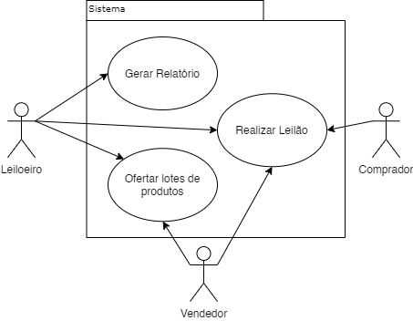

# Especificação de Casos de Uso

## Diagrama Casos de Uso

## Ofertar Lotes de Produtos

**Nome**: Ofertar lotes de produtos.

**Descrição**: Este caso de uso permite o cadastramento de um lote de produtos.

**Ator(es)**: Vendedor

**Evento Iniciador**: Vendedor solicita a criação de um novo lote de produtos.

**Pré-condições**:

- Vendedor cadastrado

**Sequência de Eventos**:

1. Vendedor solicita a criação de um novo lote de produtos.
2. Sistema confirma se o vendedor está autenticado.
3. O vendedor entra com dados dos produtos que deseja ofertar, explicitando características como nome, quantidade, preço, etc.
4. O sistema calcula o valor final do lote e envia uma mensagem de confirmação ao vendedor.
5. O vendedor confirma a criação do lote de de produtos.
6. Fim do caso de uso.

**Pós-condições**: 

Uma das condições abaixo:

- Lote de produtos gerado com sucesso.
- Lote de produtos não gerado devido a um cancelamento do processo.

**Fluxos alternativos**: 

- No passo 3, o vendedor pode cancelar a sequência de eventos, pulando para o passo 6 sem criar um lote de produtos.
- No passo 5, caso o vendedor não confirme a criação do lote de produtos, ele pode retorna ao passo 3 para editá-los e/ou cancelar a sequência de eventos.

**Exceções**:

- No passo 2, caso o vendedor não esteja autenticado, desvia para o caso de uso de autenticação.
- No passo 5, caso o vendedor confirme a criação de um lote sem produtos, uma mensagem de erro é exibida e o caso de uso se encerra.

## Realizar Leilão

**Nome**: Realizar Leilão.

**Descrição**: Este caso de uso engloba todas as ações dos atores durante o Leilão. O Leiloeiro inicializa um leilão, e a partir disso os atores podem monitorar os lances do leilão até que o leiloeiro o finalize definindo o lance vencedor.

**Evento Iniciador**: Leiloeiro solicita a inicialização de um Leilão.

**Atores**:

 - Leiloeiro
 - Comprador
 - Vendedor

**Pré-condições**: 

- Leiloeiro Autenticado.
- Lotes cadastrados disponíveis no sistema.

**Sequência de Eventos**:

1. Leiloeiro solicita a inicialização de um Leilão.
2. Sistema checa se o Leiloeiro está autenticado.
3. Sistema checa se existem lotes cadastrados disponíveis no sistema.
4. Leiloeiro adiciona o lote desejado ao leilão.
5. Leiloeiro finaliza a criação do Leilão.
6. Sistema inicia o Leilão.
7. Compradores fazem seus lances nos lotes.
8. Leiloeiro, Compradores e Vendedores podem monitorar os lances e o horário de fim do Leilão.
9. Quando o horário de fim do Leilão é atingido, o Sistema define o lance vencedor para o lote.
10. Sistema finaliza o leilão.
11. Fim de Caso de Uso.

**Pós-Condições**:

 - Leilão finalizado com sucesso

**Fluxos Alternativos**:

 - No passo 7, caso o lance de um Comprador esteja abaixo do valor mínimo do lote, o Comprador é informado e retorna ao mesmo passo do fluxo principal para realizar outro lance.
 - No passo 9, caso o lance vencedor esteja abaixo do valor mínimo do vendedor, o lote não é vendido e o Caso de Uso retorna ao fluxo principal.
 - Entre o passo 5 e o passo 9, o Vendedor pode cancelar o leilão a qualquer momento, pagando uma taxa e fazendo o Caso de Uso avançar para o passo 10.

**Exceções**:

 - No passo 2, caso o Leiloeiro não esteja autenticado, desvia para o caso de uso de autenticação.
 - No passo 3, caso não existam lotes cadastrados disponíveis no sistema, exibe uma mensagem informando que da indisponibilidade de lotes e encerra o caso de uso.

 ## Gerar Relatórios

 **Nome**: Gerar Relatórios.

**Descrição**: Este caso de uso permite a geração de um relatório completo por meio do leiloeiro contendo várias informações referentes ao leilão que acaba de ser completado.

**Evento Iniciador**: Leiloeiro solicita a geração do relatório.

**Atores**:

 - Leiloeiro

**Pré-condições**: 

- Leiloeiro Autenticado
- Leilão Finalizado com Sucesso

**Sequência de Eventos**:

1. Leiloeiro solicita a geração do relatório
2. Sistema confirma se o Leiloeiro está autenticado.
3. Sistema confirma se o Leilão foi finalizado com sucesso.
4. Sistema agrega as informações do Leilão em um documento.
5. Sistema apresenta este documento ao Leiloeiro.
6. Fim de Caso de Uso.

**Pós-Condições**:

 - Documento gerado com sucesso.

**Fluxos Alternativos**:

 - No passo 5, o Leiloeiro pode escolher baixar o documento e é desviado para a seção Baixar Relatório.

**Exceções**:

 - No passo 2, caso o Leiloeiro não esteja autenticado, desvia para o caso de uso de autenticação.
 - No passo 3, caso o Leilão não tenha sido finalizado ainda, exibe uma mensagem informando que o Leilão não acabou e encerra o caso de uso.